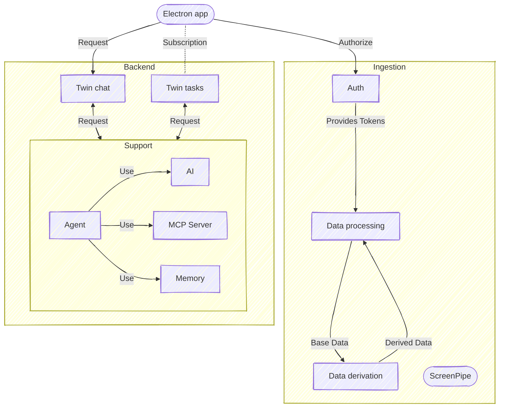

# Software Architecture

## Discuss

Discuss code organization and software engineering on the `#engineering` Slack channel.

We're using Go: let's read and embrace [Rob's proverbs](https://go-proverbs.github.io/). We may not agree with everything that's considered idiomatic Go, but embracing it reduces friction.

## Package guide

- Each package should have a clear purpose or responsibility.
  - Each package should have a "main" file named the same as the package itself.
  - Example: the "main" file of package `agi` is `pkg/agi/agi.go`.
  - Document the package itself in the "main" file.
  - Each package has an owner responsible for maintaining the package and ensuring adherence to this guide.
  - Every PR should add all owners of packages which are modified.
- Each package should have a clean and well-defined API.
  - The API consists of all exported (uppercase) identifiers.
  - All exported identifiers should be in the "main" file.
  - All exported identifiers must be documented.
  - Unexported identifiers do not need to be documented.
  - [The bigger the interface, the weaker the abstraction](https://go-proverbs.github.io/).
- The main functionality of a package should have a suitable level of testing.
- Don't use subpackages, except for internal packages.

Here is the suggested tree structure for the package `agi`.
```
pkg/
└── agi/
    ├── internal/
    │   ├── model/
    │   │   ├── model.go
    │   │   └── model_test.go    
    │   └── tokenizer/
    │       ├── tokenizer.go
    │       └── tokenizer_test.go    
    ├── preprocess.go
    ├── agi.go       # <==== MAIN FILE - PUBLIC API - DOCUMENTED
    └── agi_test.go
```

## Specific recommendations

### Keep the interface small

For the GraphQL interface between Electron and Go, keep it minimal to reduce complexity.

- Enable direct read/write access to Weaviate from Electron's main process to simplify operations.

### Keep code easy to follow

- Write code in a direct style, making it easy to understand by reading and following function calls.
- Use Go channels when appropriate, but don't overuse them. Channels should be used for communication between Goroutines when it simplifies the code.
- Use Goroutines for concurrency, but avoid creating Goroutines that persist beyond the function's execution whenever possible. Bugs in background or long-running tasks are difficult to diagnose and debug.
  - Instead, centralize the creation of all Goroutines that must perform background tasks (timers, imports, etc.) in the `main` function. This approach makes it easier to monitor and control these tasks.

## Data flow

Below is a diagram that describes the main data-flows in the application. 



- Rectangles correspond to Go components (packages).
- Database(s) and NATS are missing from the diagram.
- Many arrows are absent as they interfere with Mermaid formatting.


## Database


## Action items

Right now.

- Clean up code.
  - Top-level folders under `backend/go` should be these and no others.
    - `cmd`: binaries for running the app or user-testing some aspect of it.
      - Code specific to a binary should go here.
    - `graph`: the GraphQL interface between Electron and Go.
    - `pkg`: bulk of the code; following the above package guide.
  - Move or remove:
    - `bin`
    - `types/types.go`
    - `internal/service/docker/service.go`
    - Move utility functions under `pkg/helpers` that are used 0-1 times to the package where they are used.
      - [A little copying is better than a little dependency](https://go-proverbs.github.io/).
      - Let's discuss if there are utility functions that are used > 1 times...
    - `telegram/telegram.go` should probably move to `dataprocessing` or `mcpserver`.
    - `config/config.go` should probably move to `cmd/server`.
  - Assign owners to each package.

Soon.

- Move code under `db` to the relevant package.
- Let `Tasks/memory` graduate to a top-level package.
- ...