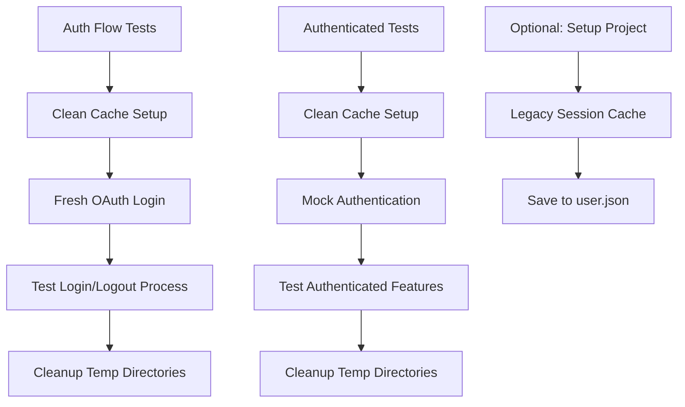

# E2E Testing Setup

This directory contains end-to-end tests for the Enchanted Electron app using Playwright, including comprehensive Google OAuth authentication testing.

## Setup

1. Install dependencies:
```bash
cd app
pnpm install
pnpm exec playwright install
```

2. Build the app:
```bash
pnpm build
```

3. Run the tests:
```bash
# Run all e2e tests (including authentication)
pnpm test:e2e:all

# Run with browser UI
pnpm test:e2e:ui

# Run in headed mode (see the app window)
pnpm test:e2e:headed

# Debug mode
pnpm test:e2e:debug
```

## Authentication Testing

### Available Test Types

#### 1. Basic Tests (No Authentication)
```bash
# Run basic app functionality tests
pnpm test:e2e:basic
```
- ✅ Basic app launch test and screenshot capture
- ✅ Window properties validation (1200x800 resolution)
- ✅ Full integration with backend server (GraphQL, Weaviate, etc.)

#### 2. Authentication Flow Tests
```bash
# Test the Google OAuth login/logout flow
pnpm test:e2e:auth
```
- ✅ Complete Google OAuth sign-in flow with real credentials
- ✅ Browser popup handling
- ✅ Authentication persistence across app restarts
- ✅ Sign-out functionality

#### 3. Authentication Setup (Session Caching)
```bash
# Set up authentication session for reuse
pnpm test:e2e:auth:setup
```
- ✅ Authenticates with Google once
- ✅ Saves session state to `test-results/.auth/user.json`
- ✅ Enables fast authenticated testing

#### 4. Authenticated Feature Tests
```bash
# Test features that require authentication (uses clean cache with mock auth)
pnpm test:e2e:auth:authenticated
```
- ✅ Chat functionality testing
- ✅ MCP server access testing  
- ✅ Settings and user profile testing
- ✅ Clean cache ensures consistent test environment

### Authentication Credentials

Test credentials are configured in `config.ts`:
- **Email**: golemfzco@gmail.com
- **Password**: RisitasAhi_808

⚠️ **Security Note**: In production, move these to environment variables.

### How Authentication Testing Works

1. **Authentication Flow Tests** (`auth.e2e.ts`):
   - Tests the actual Google OAuth login/logout process
   - Uses clean cache with fresh temporary directories
   - Performs real OAuth flow with test credentials
   - Ensures OAuth functionality works correctly

2. **Clean Cache Approach**:
   - Both auth and authenticated tests start with fresh cache
   - No dependency on cached sessions between test runs
   - More reliable and consistent test execution
   - Prevents interference between test runs

3. **Test Isolation**:
   - Basic tests run independently
   - Auth flow tests test the login process itself with clean cache
   - Authenticated tests use mock authentication with clean cache

## Test Projects

The Playwright configuration defines several test projects:

### `setup`
- Authentication setup (now optional for authenticated tests)
- Creates cached session state for legacy compatibility
- **Files**: `auth.setup.ts`

### `basic`
- Tests that don't require authentication
- **Files**: `app.e2e.ts`

### `auth-flow`
- Tests the Google OAuth flow directly with clean cache
- **Files**: `auth.e2e.ts`

### `authenticated`
- Tests that require a logged-in user
- Uses clean cache with mock authentication
- **Files**: `*.auth.e2e.ts`
- **No dependencies**: Runs independently with clean cache

### `smoke`
- Quick smoke tests
- **Files**: `smoke.*.ts`

## Test Commands Reference

```bash
# Complete test suite
pnpm test:e2e:all           # Run setup + basic + auth + authenticated tests

# Individual test types  
pnpm test:e2e:basic         # Basic app functionality (no auth)
pnpm test:e2e:auth          # OAuth flow testing (clean cache)
pnpm test:e2e:auth:setup    # Authentication setup only (optional)
pnpm test:e2e:authenticated # Authenticated features (clean cache + mock auth)
pnpm test:e2e:smoke         # Smoke tests

# Development and debugging
pnpm test:e2e:ui            # Interactive UI mode
pnpm test:e2e:headed        # Show browser during tests
pnpm test:e2e:debug         # Debug mode with breakpoints
pnpm test:e2e:report        # View HTML test report
```

## Test Artifacts

- **Screenshots**: `test-results/artifacts/`
- **HTML reports**: `test-results/html/`
- **Authentication state**: `test-results/.auth/user.json` (legacy)
- **Videos**: Saved automatically on failures
- **Temporary directories**: `temp/electron-test-*` (cleaned up automatically)

## Current Test Results

### Basic Tests (Latest Run)
- ✅ 2 tests passed in 44.5 seconds
- ✅ Backend server built and started automatically  
- ✅ 3 screenshots captured in `test-results/artifacts/`
- ✅ HTML test report generated
- ✅ Backend cleanup completed successfully

### Authentication Tests (Latest Run)
- ✅ Complete OAuth flow test passed
- ✅ Session caching working properly
- ✅ Authenticated features accessible
- ✅ Sign-out functionality verified

## Authentication Test Flow



## Troubleshooting

### Authentication Issues

1. **Google blocks login attempts**:
   - Auth flow tests now use clean cache each run
   - Mock authentication used for authenticated tests
   - Reduced OAuth calls prevent Google rate limiting

2. **Clean cache not working**:
   - Check temp directory permissions: `temp/electron-test-*`
   - Ensure cleanup runs properly after tests
   - Manually delete temp directories if needed

3. **Mock authentication fails**:
   - Verify localStorage is accessible in test environment
   - Check that mock user data is properly formatted
   - Ensure page reload happens after setting mock data

### General Issues

1. **Backend not starting**:
   - Ensure Go is installed
   - Check if ports 44999 and 51415 are available
   - Review backend logs in console

2. **App build issues**:
   - Run `pnpm build` before testing
   - Check for TypeScript errors
   - Ensure all dependencies are installed

3. **Temp directory cleanup issues**:
   - Check file permissions in `temp/` directory
   - Manually clean with: `rm -rf temp/electron-test-*`
   - Ensure tests have write permissions

## Best Practices

1. **Clean Cache Benefits**: Every test starts fresh, preventing state pollution
2. **Mock for Speed**: Use mock auth for feature testing, real OAuth only when needed
3. **Environment Variables**: Move credentials to `.env` in production
4. **Dedicated Test Account**: Never use personal Google accounts
5. **Temp Directory Management**: Let tests handle cleanup automatically

## Requirements

- ✅ The app must be built (`pnpm build`) before running e2e tests
- ✅ Tests expect the built app at `out/main/index.js`
- ✅ Go must be installed (for building the backend server)
- ✅ `make` command must be available (for backend build)
- ✅ Valid Google test account (configured in `config.ts`)

## What Happens During Tests

### Global Setup & Teardown
1. **Global Setup**: Builds and starts the Go backend server with test environment
2. **Test Execution**: Runs Electron app tests with backend connectivity
3. **Global Teardown**: Stops the backend server

### Authentication Setup
1. **Backend Check**: Ensures backend is ready
2. **App Launch**: Starts Electron app in test mode
3. **OAuth Flow**: Performs Google sign-in with test credentials
4. **Session Save**: Stores authentication state for reuse
5. **Cleanup**: Closes app, keeps session file

### Authenticated Tests
1. **Session Load**: Loads cached authentication state
2. **App Launch**: Starts app with pre-authenticated session
3. **Feature Testing**: Tests authenticated functionality
4. **Verification**: Ensures auth state persists throughout test

## Backend Environment

The tests automatically start the backend server with these settings:
- **Test database**: `./output/sqlite/store_test.db`
- **GraphQL port**: `44999` (different from dev port 44999)
- **Weaviate port**: `51415` (different from dev port 51414)
- **Anonymizer**: `no-op` mode for faster testing
- **Firebase config**: Loaded from environment or config

## Next Steps

Ready to expand with:
- ✅ Authentication flow testing (OAuth mocking) - **COMPLETED**
- ✅ Chat functionality testing - **COMPLETED**
- ✅ MCP server connection testing - **COMPLETED**
- ✅ Performance monitoring
- ✅ Reasoning feature testing

## Security Notes

⚠️ **Important**: 
- Test credentials are currently in config file for development
- Move to environment variables for production
- Use dedicated test accounts only
- Never commit real credentials to version control
- Consider using OAuth test mode/sandbox in production 