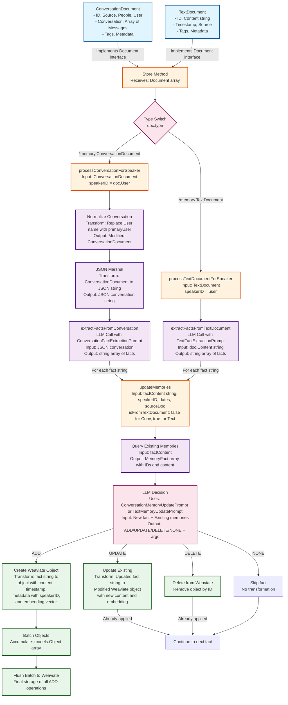

```mermaid
graph TD
    %% Entry Points
    CD[ConversationDocument<br/>- ID, Source, People, User<br/>- Conversation: Array of Messages<br/>- Tags, Metadata] 
    TD[TextDocument<br/>- ID, Content string<br/>- Timestamp, Source<br/>- Tags, Metadata]
    
    %% Store Entry
    CD --> |Implements Document interface| Store[Store Method<br/>Receives: Document array]
    TD --> |Implements Document interface| Store
    
    %% Type Assertion
    Store --> TypeSwitch{Type Switch<br/>doc.type}
    
    %% Conversation Path
    TypeSwitch --> |*memory.ConversationDocument| ConvProcess[processConversationForSpeaker<br/>Input: ConversationDocument<br/>speakerID = doc.User]
    
    ConvProcess --> ConvNormalize[Normalize Conversation<br/>Transform: Replace User name with primaryUser<br/>Output: Modified ConversationDocument]
    
    ConvNormalize --> ConvJSON[JSON Marshal<br/>Transform: ConversationDocument to JSON string<br/>Output: JSON conversation string]
    
    ConvJSON --> ConvExtract[extractFactsFromConversation<br/>LLM Call with ConversationFactExtractionPrompt<br/>Input: JSON conversation<br/>Output: string array of facts]
    
    %% Text Path
    TypeSwitch --> |*memory.TextDocument| TextProcess[processTextDocumentForSpeaker<br/>Input: TextDocument<br/>speakerID = user]
    
    TextProcess --> TextExtract[extractFactsFromTextDocument<br/>LLM Call with TextFactExtractionPrompt<br/>Input: doc.Content string<br/>Output: string array of facts]
    
    %% Converged Path - Fact Processing
    ConvExtract --> |For each fact string| UpdateMem[updateMemories<br/>Input: factContent string, speakerID, dates, sourceDoc<br/>isFromTextDocument: false for Conv, true for Text]
    TextExtract --> |For each fact string| UpdateMem
    
    %% Memory Decision
    UpdateMem --> Query[Query Existing Memories<br/>Input: factContent<br/>Output: MemoryFact array with IDs and content]
    
    Query --> Decision[LLM Decision<br/>Uses: ConversationMemoryUpdatePrompt or TextMemoryUpdatePrompt<br/>Input: New fact + Existing memories<br/>Output: ADD/UPDATE/DELETE/NONE + args]
    
    %% Action Branches
    Decision --> |ADD| AddAction[Create Weaviate Object<br/>Transform: fact string to<br/>object with content, timestamp,<br/>metadata with speakerID,<br/>and embedding vector]
    
    Decision --> |UPDATE| UpdateAction[Update Existing<br/>Transform: Updated fact string to<br/>Modified Weaviate object<br/>with new content and embedding]
    
    Decision --> |DELETE| DeleteAction[Delete from Weaviate<br/>Remove object by ID]
    
    Decision --> |NONE| NoAction[Skip fact<br/>No transformation]
    
    %% Final Batching
    AddAction --> Batch[Batch Objects<br/>Accumulate: models.Object array]
    UpdateAction --> |Already applied| Continue[Continue to next fact]
    DeleteAction --> |Already applied| Continue
    NoAction --> Continue
    
    Batch --> Flush[Flush Batch to Weaviate<br/>Final storage of all ADD operations]
    
    %% Styling
    classDef docType fill:#e1f5fe,stroke:#01579b,stroke-width:2px
    classDef process fill:#fff3e0,stroke:#e65100,stroke-width:2px
    classDef transform fill:#f3e5f5,stroke:#4a148c,stroke-width:2px
    classDef decision fill:#fce4ec,stroke:#880e4f,stroke-width:2px
    classDef storage fill:#e8f5e9,stroke:#1b5e20,stroke-width:2px
    
    class CD,TD docType
    class Store,ConvProcess,TextProcess,UpdateMem process
    class ConvNormalize,ConvJSON,ConvExtract,TextExtract,Query transform
    class TypeSwitch,Decision decision
    class AddAction,UpdateAction,DeleteAction,Batch,Flush storage
```